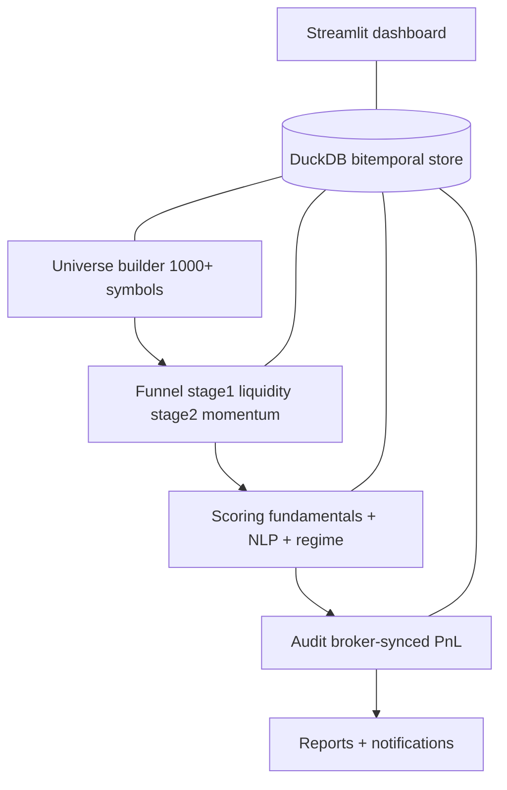

# Quant-AI
**Institutional-grade systematic equity pipeline**

[](https://github.com/akmal523/quant/actions/workflows/ci.yml)
[](https://codecov.io/gh/akmal523/quant)
[](pyproject.toml)
[](LICENSE)

Broker-aware, EUR-native systematic equity analysis for a solo family office on
Trade Republic. Scans a smart 1000+ ticker universe, filters it to a handful of
survivors, and produces EUR-native buy/hold/sell guidance plus a broker-synced
portfolio audit. Python orchestrates; the heavy lifting runs in Rust (Polars),
SQL (DuckDB), and C++-backed libraries (cvxpy, selectolax).

> **New here?** Read [`CONTEXT.md`](CONTEXT.md) for the domain vocabulary, data
> contracts, and architecture map. It is the canonical reference for every term
> used below.

---

## Highlights

- **Bitemporal PIT data** - `as_of_date` + `published_date`; backtests cannot see
  a fundamental before the market did. No lookahead bias.
- **Mean-CVaR tail-risk optimization** - optimizes the worst 5% Expected
  Shortfall (Rockafellar-Uryasev), not variance.
- **Broker-synced PnL reconciliation** - portfolio PnL is copied from the broker
  and diffed against the system estimate; never price-guessed.
- **NLP-driven sentiment scoring** - 8-K / news text scored with FinBERT.
- **Hard data-quality assertions** - duplicate timestamps, unexplained >50%
  drops, and bad D/E abort the pipeline (fail closed).
- **Golden-file CI** - deterministic backtest snapshots fail on > 0.01% drift.

---

## Quick Start

```bash
# 1. Install
pip install -e ".[dashboard]"
python -m spacy download en_core_web_sm   # optional NER

# 2. Configure
#    data/portfolio.csv   -> your Trade Republic holdings
#    .env.example         -> optional notifier / API keys
#    quant/config.py      -> all tunable thresholds

# 3. Run (two steps)
quant update      # step 1: fetch data + cache funnel survivors
quant run         # step 2: score, audit, report
```

Legacy entry points still work: `python3 data_updater.py` and `python3 main.py`.

```bash
streamlit run quant/dashboard.py   # dashboard
quant reconcile                    # diff portfolio vs broker export
bash scripts/setup_cron.sh         # optional daily automation
```

### Portfolio file (`data/portfolio.csv`)

```csv
Symbol,Avg_Entry_Price,Current_Value_EUR,Broker_PnL_EUR
EUNL.DE,125.03,281.25,12.00
AMZN,220.55,150.41,5.20
```

`Invested_EUR = Current_Value_EUR - Broker_PnL_EUR` is derived; `Broker_PnL_EUR`
is broker truth, never price-guessed. Comments after `#` are stripped.

---

## Architecture



Step 1 (`quant update`) fetches market data, adjusts corporate actions, runs the
hard data-quality gate, and caches the funnel survivors. Step 2 (`quant run`)
reads that cache, scores, audits, and reports. Step 2 does **not** re-fetch the
universe.

### Key modules

| Module | Responsibility |
|:--|:--|
| [`quant/main.py`](quant/main.py) | Orchestration: load -> filter -> NLP -> score -> audit -> report |
| [`quant/data/data_updater.py`](quant/data/data_updater.py) | Incremental DuckDB market data + funnel; caches survivors |
| [`quant/data/universe_builder.py`](quant/data/universe_builder.py) | Builds `universe_master` from index constituents + ETFs |
| [`quant/data/funnel.py`](quant/data/funnel.py) | Two-stage filter (liquidity -> momentum) + survivor cache |
| [`quant/analytics/scoring.py`](quant/analytics/scoring.py) | Factor model, regime HMM, stewardship, capital allocation |
| [`quant/portfolio/portfolio.py`](quant/portfolio/portfolio.py) | Broker-synced audit, EUR PnL, reconciliation |
| [`quant/portfolio/optimizer.py`](quant/portfolio/optimizer.py) | cvxpy Mean-Variance + Mean-CVaR with bucket constraints |
| [`quant/execution/tca.py`](quant/execution/tca.py) | Implementation Shortfall (TCA) + `trade_log` |
| [`quant/cli/__init__.py`](quant/cli/__init__.py) | `quant` console command |
| [`quant/paths.py`](quant/paths.py) | CWD-independent path resolver |

---

## Configuration

All tunables live in [`quant/config.py`](quant/config.py). Key settings:

| Parameter | Default | Description |
|:---|---:|:---|
| `WEIGHT_FUNDAMENTALS` / `_STEWARDSHIP` / `_TECHNICAL` / `_SENTIMENT` | 30 / 30 / 15 / 25 | Scoring weights |
| `MIN_STRUCT_GRADE_FOR_BUY` | 75 | Structural floor for CORE classification |
| `BROKER_CASH_APY` | 0.0225 | TR cash yield (risk-free rate) |
| `ROUND_TRIP_FEE_EUR` | 2.0 | Active-trade round-trip fee |
| `SAFETY_BUCKET_MIN` / `CORE_BUCKET_MIN` / `ALPHA_BUCKET_MAX` | 0.10 / 0.40 / 0.50 | Bucket constraints |
| `FUNNEL_STAGE1_TARGET` / `FUNNEL_TOP_N` | 300 / 24 | Funnel caps |
| `CVAR_ALPHA` | 0.05 | Mean-CVaR tail (Expected Shortfall) |
| `MAX_DAILY_DRAWDOWN` / `VOL_KILL_MULTIPLIER` | 0.03 / 2.0 | Kill-switch thresholds |
| `REPORTING_LAG_DAYS` | 45 | PIT publication lag (no lookahead) |

Environment variables (optional) are documented in [`.env.example`](.env.example).

---

## Testing

Tests are hermetic: an ephemeral DuckDB is injected by
[`tests/conftest.py`](tests/conftest.py); production data is never touched.

```bash
pip install -e ".[test]"
pytest -n auto            # parallel; coverage floor enforced by .coveragerc
```

The coverage floor is a ratchet in [`.coveragerc`](.coveragerc) (v10.4.2
baseline 42%, target 80%). CI ([`.github/workflows/ci.yml`](.github/workflows/ci.yml))
runs the full suite plus the golden snapshot gate on every push and PR. See
[`tests/README.md`](tests/README.md) for the isolation model, determinism rules,
and golden-file regeneration process.

---

## Contributing

See [`CONTRIBUTING.md`](CONTRIBUTING.md) for setup, style (ruff, line length
100), type checking (pyright), and the conventional-commit convention. By
participating you agree to the [Code of Conduct](CODE_OF_CONDUCT.md).

---

## Documentation

| Document | Purpose |
|:--|:--|
| [`CONTEXT.md`](CONTEXT.md) | Domain vocabulary, data contracts, module map, ADRs |
| [`CHANGELOG.md`](CHANGELOG.md) | Full version history |
| [`tests/README.md`](tests/README.md) | Test isolation, coverage, golden files |
| [`plans/`](plans/) | Engineering change proposals |
| API docs | `mkdocs serve` (deployed to GitHub Pages) |

---

## Disclaimer

All output is for informational purposes. Probabilistic models and NLP sentiment
analysis involve inherent risk. **Past performance does not guarantee future
results.** The universe contains only currently-listed instruments - historical
backtest figures are systematically overstated due to survivorship bias.
