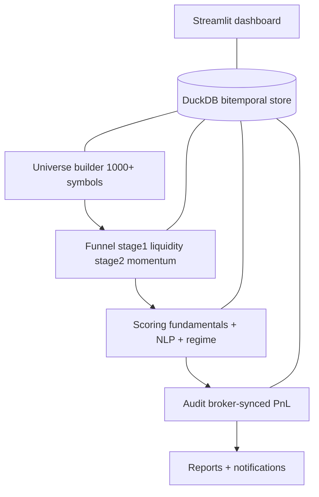

# Quant-AI
**Daily portfolio manager for a solo family office on Trade Republic**

[](https://github.com/akmal523/quant/actions/workflows/ci.yml)
[](https://codecov.io/gh/akmal523/quant)
[](pyproject.toml)
[](LICENSE)

Quant-AI takes one snapshot of your portfolio per day after the market close,
reviews your holdings against their targets, and says in plain language what to
add, trim, or leave alone. It is built for long-horizon resource management, not
for intraday trading: you place orders in the broker app, and Quant-AI advises
and explains. The browser app is the product; the terminal is an optional power
tool.

Live briefing: https://akmal523.github.io/quant/

> **New here?** Read [`CONTEXT.md`](CONTEXT.md) for the domain vocabulary, data
> contracts, architecture map, and the full **v10.6.0 cycle ledger** (every
> decision, bug, and guard since 10.5.2).

---

## What's new in 10.6.0

- **Four-page workspace** — Today decides, Portfolio edits, Explore explains,
  Settings maintains — with one central copy module and a banned-token test.
- **Working universe** — `asset_registry` holds exactly the tracked set
  (funnel survivors ∪ CORE ∪ ACTIVE ∪ portfolio ∪ broker registry ∪ curated ∪
  broad ETFs); the 1000+ discovery pool never leaks in.
- **Explore search** by name, symbol, ISIN, or **theme** (`data/themes.csv`),
  plus a discovery loop that can bring a universe instrument into tracking.
- **`quant doctor`** — one read-only diagnosis: registry counts, names state,
  metadata probes, news/sentiment distribution, search probes, explore-card
  probes, and an advice-engine oracle.
- **Honest advice** — drift vs target drives add/trim; a rebalance cooldown
  surfaces as "Waiting until {date}" plus a footnote, never silence.

---

## Highlights

- **Bitemporal PIT data** - `as_of_date` + `published_date`; backtests cannot see
  a fundamental before the market did. No lookahead bias.
- **Mean-CVaR tail-risk optimization** - optimizes the worst 5% Expected
  Shortfall (Rockafellar-Uryasev), not variance.
- **Broker-synced PnL reconciliation** - portfolio PnL is copied from the broker
  and diffed against the system estimate; never price-guessed.
- **NLP-driven sentiment scoring** - 8-K / news text scored with FinBERT; there is no dictionary fallback, and text with no evidence yields a neutral score with a confidence penalty.
- **Hard data-quality assertions** - duplicate timestamps, unexplained >50%
  drops, and bad D/E abort the pipeline (fail closed).
- **Golden-file CI** - deterministic backtest snapshots fail on > 0.01% drift.

---

## Quick start (browser-first)

```bash
pip install -e .
quant dash
```

Open the address Streamlit prints (usually http://localhost:8501).
Display names and ISINs are backfilled automatically the first time the
app runs. On a phone on
the same Wi-Fi, run `quant dash --lan` and open the printed LAN address.

Everything else happens in the browser:

1. Open Portfolio and add your holdings (type a name, symbol, or ISIN).
2. Set cash and your risk profile.
3. Press Save and review, then read the advice on Today.

The first run walks you through these three steps.

## Advanced: command line

The terminal is optional. Three commands cover the daily cycle:

| Command | What it does |
|:--|:--|
| `quant update` | Refresh market data (step 1) |
| `quant run` | Review the portfolio and write the briefing (step 2) |
| `quant publish` | Render the static Published Briefing for the web |
| `quant doctor` | Read-only diagnosis (registry, names, news, search, advice) |

Add `--verbose` for per-symbol detail. Logs live under `outputs/run_*/`.

The External URL Streamlit prints is your public IP only if your router forwards
the port; by default it does not. Never expose Quant-AI to the internet without
putting it behind an authenticating reverse proxy. `quant dash` binds localhost
only; to serve on your local network (phone on the same Wi-Fi), run
`quant dash --lan`.

### Portfolio file (`data/portfolio.csv`)

```csv
Symbol,Avg_Entry_Price,Current_Value_EUR,Broker_PnL_EUR
EUNL.DE,125.03,281.25,12.00
AMZN,220.55,150.41,5.20
```

`Invested_EUR = Current_Value_EUR - Broker_PnL_EUR` is derived; `Broker_PnL_EUR`
is broker truth, never price-guessed. Comments after `#` are stripped.

### Account file (`data/account.yaml`)

```yaml
base_currency: EUR
cash_eur: 10400.0
risk_profile: balanced
savings_plan_day: 1   # optional, 1-31
```

`risk_profile` is one of `conservative` / `balanced` / `aggressive`. The selected
profile in `data/account.yaml` overrides the bucket defaults in
[`quant/config.py`](quant/config.py).

`savings_plan_day` is optional (1-31). When set and at least one holding routes to
a savings plan, Today shows the countdown under the actions block
(`Savings plan executes in {n} days ({date}); additions before that date apply
this month.`), or `Savings plan executes today.` on the day itself.

---

## Architecture



Step 1 (`quant update`) fetches market data, adjusts corporate actions, runs the
hard data-quality gate, and caches the funnel survivors. Step 2 (`quant run`)
reads that cache, scores, audits, and reports. Step 2 does **not** re-fetch the
universe.

### Key modules

| Module | Responsibility |
|:--|:--|
| [`quant/main.py`](quant/main.py) | Orchestration: load -> filter -> NLP -> score -> audit -> report |
| [`quant/data/data_updater.py`](quant/data/data_updater.py) | Incremental DuckDB market data + funnel; caches survivors |
| [`quant/data/universe_builder.py`](quant/data/universe_builder.py) | Builds `universe_master` from index constituents + ETFs |
| [`quant/data/funnel.py`](quant/data/funnel.py) | Two-stage filter (liquidity -> momentum) + survivor cache |
| [`quant/analytics/scoring.py`](quant/analytics/scoring.py) | Factor model, regime HMM, stewardship, capital allocation |
| [`quant/portfolio/portfolio.py`](quant/portfolio/portfolio.py) | Broker-synced audit, EUR PnL, reconciliation |
| [`quant/portfolio/optimizer.py`](quant/portfolio/optimizer.py) | cvxpy Mean-Variance + Mean-CVaR with bucket constraints |
| [`quant/execution/tca.py`](quant/execution/tca.py) | Implementation Shortfall (TCA) + `trade_log` |
| [`quant/cli/__init__.py`](quant/cli/__init__.py) | `quant` console command + `doctor` |
| [`quant/ui/copy.py`](quant/ui/copy.py) | Every user-facing string + formatter (P14) |
| [`quant/ui/render.py`](quant/ui/render.py) | The four page renderers |
| [`quant/ui/cards.py`](quant/ui/cards.py) | Explore card fields (one source) |
| [`quant/ui/search.py`](quant/ui/search.py) | Instrument + theme search index |
| [`quant/reporting/artifacts.py`](quant/reporting/artifacts.py) | The five UI artifact accessors |
| [`quant/data/names.py`](quant/data/names.py) | Display-name cleaning + backfill |
| [`quant/data/registry_repair.py`](quant/data/registry_repair.py) | Working-universe sync + ISIN heal |
| [`quant/data/news.py`](quant/data/news.py) | News fetch + 24 h cache + outage counter |
| [`quant/portfolio/history.py`](quant/portfolio/history.py) | Portfolio value history |
| [`quant/portfolio/cash_rate.py`](quant/portfolio/cash_rate.py) | Dated cash-rate schedule |
| [`quant/paths.py`](quant/paths.py) | CWD-independent path resolver |

---

## Configuration

All tunables live in [`quant/config.py`](quant/config.py). Key settings:

| Parameter | Default | Description |
|:---|---:|:---|
| `WEIGHT_FUNDAMENTALS` / `_STEWARDSHIP` / `_TECHNICAL` / `_SENTIMENT` | 30 / 30 / 15 / 25 | Scoring weights |
| `MIN_STRUCT_GRADE_FOR_BUY` | 75 | Structural floor for CORE classification |
| Cash rate | dated schedule in `quant/portfolio/cash_rate.py` | Trade Republic yield used as the risk-free rate (2.5 percent from 16 Sep 2026) |
| `ROUND_TRIP_FEE_EUR` | 2.0 | Active-trade round-trip fee |
| `SAFETY_BUCKET_MIN` / `CORE_BUCKET_MIN` / `ALPHA_BUCKET_MAX` | 0.10 / 0.40 / 0.50 | Bucket constraints |
| `FUNNEL_STAGE1_TARGET` / `FUNNEL_TOP_N` | 300 / 24 | Funnel caps |
| `CVAR_ALPHA` | 0.05 | Mean-CVaR tail (Expected Shortfall) |
| `MAX_DAILY_DRAWDOWN` / `VOL_KILL_MULTIPLIER` | 0.03 / 2.0 | Kill-switch thresholds |
| `REPORTING_LAG_DAYS` | 45 | PIT publication lag (no lookahead) |

Environment variables (optional) are documented in [`.env.example`](.env.example).

---

## Testing

Tests are hermetic: an ephemeral DuckDB is injected by
[`tests/conftest.py`](tests/conftest.py); production data is never touched.

```bash
pip install -e ".[test]"
pytest -n auto            # parallel; coverage floor enforced by .coveragerc
```

The coverage floor is a ratchet in [`.coveragerc`](.coveragerc) (v10.4.2
baseline 42%, target 80%). CI ([`.github/workflows/ci.yml`](.github/workflows/ci.yml))
runs the full suite plus the golden snapshot gate on every push and PR. See
[`tests/README.md`](tests/README.md) for the isolation model, determinism rules,
and golden-file regeneration process.

---

## Contributing

All user-facing language lives in [`quant/ui/copy.py`](quant/ui/copy.py), guarded
by [`tests/test_ui_copy.py`](tests/test_ui_copy.py); change copy there, never
inline. See [`CONTRIBUTING.md`](CONTRIBUTING.md) for setup, style (ruff, line
length 100), type checking (pyright), and the conventional-commit convention. By
participating you agree to the [Code of Conduct](CODE_OF_CONDUCT.md).

---

## Documentation

| Document | Purpose |
|:--|:--|
| [`CONTEXT.md`](CONTEXT.md) | Domain vocabulary, data contracts, module map, ADRs |
| [`CHANGELOG.md`](CHANGELOG.md) | Full version history |
| [`tests/README.md`](tests/README.md) | Test isolation, coverage, golden files |
| [`plans/`](plans/) | Engineering change proposals |
| API docs | `mkdocs serve` (deployed to GitHub Pages) |

---

## Disclaimer

All output is for informational purposes. Probabilistic models and NLP sentiment
analysis involve inherent risk. **Past performance does not guarantee future
results.** The universe contains only currently-listed instruments - historical
backtest figures are systematically overstated due to survivorship bias.
