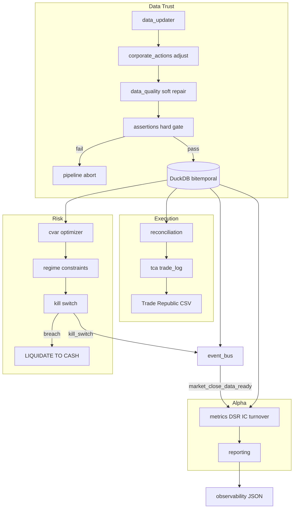

# Quant-AI v10.4.0 - Institutional-Grade Elevation Plan

Goal: lift Quant-AI from a capable personal tool to a trustworthy,
execution-aware, risk-surviving system. Shift focus from *generating signals*
to *guaranteeing reliability, execution reality, and risk survival*.

Baseline: v10.3.6. Target: v10.4.0.

Design constraints (from `rules_light.txt` / `rules_heavy.txt`):
- Local-first, hermetic. No network at build/test time.
- Pure core / imperative shell. Computation stays side-effect free.
- Atomic patches only. One tracer-bullet test -> one minimal implementation.
- Compiler-in-the-loop. Every phase ends green under `pytest`.
- No heavy new runtime dependency unless it buys real safety. Prefer native
  DuckDB/Polars/Python assertions over Great Expectations.

---

## Current State vs Target

| Domain | Current | Target |
|:--|:--|:--|
| Data | Incremental DuckDB, soft quality gate, PIT fundamentals table unused by scoring | Bitemporal PIT enforced + hard assertions that fail the pipeline |
| Risk | cvxpy Mean-Variance, `RiskMonitor` statuses | Mean-CVaR + hard kill-switch + regime-conditional limits |
| Execution | Broker-synced PnL, static fee hurdle | Implementation Shortfall TCA + volatility-aware min trade size + auto reconciliation |
| Testing | Standalone test scripts | Pytest + Golden File snapshot in GitHub Actions |
| Metrics | Sharpe/Sortino | Deflated Sharpe Ratio + Alpha Decay IC curves + turnover variance |
| Ops | `print()` output | Structured JSON telemetry + automated kill switch |

---

## Phase 1 - Data Trust & Bitemporal Integrity

### 1.1 Bitemporal PIT enforcement
- `fundamentals_history` already has `as_of_date` / `published_date`. Wire it:
  - [`quant/data/fundamentals.py`](quant/data/fundamentals.py): always persist a
    PIT snapshot on fetch (call `save_fundamentals_history`) with
    `published_date = as_of_date + reporting_lag_days`.
  - Scoring and backtest read only `get_fundamentals_as_of(symbol, as_of_date)`.
    Never let a March 31 backtest see April 15 earnings.
- Add `ingested_at TIMESTAMP` to `market_history` (audit: when the row hit the DB).
- Add `REPORTING_LAG_DAYS` to [`quant/config.py`](quant/config.py).

### 1.2 Automated Corporate Actions Engine
- New [`quant/data/corporate_actions.py`](quant/data/corporate_actions.py):
  - Detect splits from `Close` discontinuity + `Volume` jump ratio.
  - Adjust historical prices and the portfolio cost basis (`Avg_Entry_Price`).
  - Flag dividend reinvestment events.
  - Pure functions: `detect_split`, `adjust_for_split`, `apply_corporate_actions`.
- Unadjusted data in a backtest guarantees false returns; adjustment runs before
  any feature/scoring step in [`quant/data/data_updater.py`](quant/data/data_updater.py).

### 1.3 Data Quality Assertions (CI/CD gate)
- New [`quant/data/assertions.py`](quant/data/assertions.py): hard assertions that
  return pass/fail, wired to auto-fail the pipeline (raise on violation).
  - Price drop > 50% in one day without a split flag -> FAIL.
  - `DebtToEquity < 0` or `NaN` for profitable companies -> FAIL.
  - Duplicate `(Symbol, Date)` timestamps -> FAIL.
- Assertion suite is pytest-callable (offline, pure) so CI enforces it.
- [`quant/data/data_quality.py`](quant/data/data_quality.py) keeps soft repair;
  assertions are the hard gate that stops bad data entering DuckDB.

---

## Phase 2 - Execution Reality & TCA

### 2.1 Implementation Shortfall (IS)
- New [`quant/execution/tca.py`](quant/execution/tca.py):
  - `implementation_shortfall(signal_price, fill_price, side)` -> slippage bps.
  - `record_signal` / `record_fill` persist to a new `trade_log` table.
- New `trade_log` table in [`quant/data/database.py`](quant/data/database.py):
  `ts, symbol, side, signal_price, signal_ts, fill_price, fill_ts, slippage_bps, fee_eur`.

### 2.2 Empirical Slippage Model + volatility-aware min trade size
- Extend [`quant/portfolio/optimizer.py`](quant/portfolio/optimizer.py):
  `minimum_trade_size_vol_aware(expected_alpha_bps, asset_vol, fee_eur)`.
  A 1 EUR fee on a 50 EUR trade is a 2% instant loss; scale the floor by asset
  volatility so the fixed cost is amortized over an adequate notional.
- [`quant/execution/routing.py`](quant/execution/routing.py) consumes the new floor.

### 2.3 Automated Broker Reconciliation
- New [`quant/execution/reconciliation.py`](quant/execution/reconciliation.py):
  compare DuckDB theoretical portfolio state vs a Trade Republic CSV export.
  Emit divergence alerts (missing dividend, unexecuted limit order).
- New [`scripts/reconcile_broker.py`](scripts/reconcile_broker.py) CLI.
- Add `portfolio_snapshot` table (daily theoretical state) for diffing.

---

## Phase 3 - Institutional Risk & Capital Preservation

### 3.1 Mean-CVaR Optimization
- Extend [`quant/portfolio/optimizer.py`](quant/portfolio/optimizer.py) with
  `optimize_portfolio_cvar(...)` using the Rockafellar-Uryasev LP form:
  `min VaR + 1/(alpha*N) * sum(u)` s.t. `u >= -r@w - VaR, u >= 0`.
  Optimizes average loss in the worst 5% of scenarios; robust to fat tails.
- Keep Mean-Variance available; add `CVAR_ALPHA` to config.

### 3.2 Hard Circuit Breakers / Kill Switch
- Extend [`quant/portfolio/risk_monitor.py`](quant/portfolio/risk_monitor.py) with
  a hard kill switch: breach -> emit `LIQUIDATE TO CASH` signal and pause scanner.
  - Trigger: `MAX_DAILY_DRAWDOWN` > 3%, or realized vol > `VOL_KILL_MULTIPLIER` x target.
  - Publish `KILL_SWITCH` on [`quant/infra/event_bus.py`](quant/infra/event_bus.py);
    `main.py` scanner subscribes and halts.
- New config: `MAX_DAILY_DRAWDOWN`, `VOL_KILL_MULTIPLIER`.

### 3.3 Regime-Conditional Constraints
- New [`quant/portfolio/regime_constraints.py`](quant/portfolio/regime_constraints.py):
  map HMM regime -> `(max_single_weight, max_leverage)`.
  Bear/Chop -> max single stock 2%, leverage 0. Bull -> normal caps.
- [`quant/portfolio/optimizer.py`](quant/portfolio/optimizer.py) applies the caps
  from the current regime.

---

## Phase 4 - Software Engineering & CI/CD Rigor

### 4.1 Snapshot / Regression Testing (golden files)
- New `tests/golden/` fixtures: exact 2024 backtest output (signals, weights, PnL).
- New [`tests/test_golden_snapshot.py`](tests/test_golden_snapshot.py): fail if new
  output differs from the golden file by > 0.01%.
- Add a regeneration helper `scripts/make_golden.py`.

### 4.2 Event-Driven Architecture (EDA)
- Extend [`quant/infra/event_bus.py`](quant/infra/event_bus.py) with canonical
  events: `market_close_data_ready`, `scoring_complete`, `kill_switch`.
- [`quant/data/data_updater.py`](quant/data/data_updater.py) publishes
  `market_close_data_ready`; scoring subscribes. Decouples fetchers so a Yahoo
  outage cannot cascade.

### 4.3 Structured Telemetry (Observability)
- Extend [`quant/infra/observability.py`](quant/infra/observability.py): emit
  structured JSON per step; track data fetch latency, DuckDB query time, and
  API rate-limit hits. Replace `print()` in hot pipeline paths.
- Persist telemetry into the run artifact (`outputs/run_<ts>/telemetry.json`).

### 4.4 GitHub Actions CI
- New `.github/workflows/ci.yml`: install deps, run `pytest`, run the golden
  snapshot gate. Fails the PR on regression.

---

## Phase 5 - Advanced Alpha Metrics & Reporting

### 5.1 Deflated Sharpe Ratio (DSR)
- New [`quant/analytics/metrics.py`](quant/analytics/metrics.py):
  Bailey & Lopez de Prado DSR, penalizing number of trials + skew/kurtosis.
  `deflated_sharpe_ratio(returns, n_trials)`.

### 5.2 Alpha Decay Curves (IC)
- `information_coefficient(signal, forward_returns)` at T+1 / T+5 / T+21.
- Output an IC decay table; smooth decay validates exit logic.

### 5.3 Probabilistic Turnover
- `turnover_stats(weights_series)` returns mean and variance of turnover.
  High variance => unpredictable transaction costs.

### 5.4 Reporting integration
- [`quant/reporting/reporting_advanced.py`](quant/reporting/reporting_advanced.py):
  add an "ALPHA QUALITY" section (DSR, IC curve, turnover variance).

---

## Documentation to v10.4.0
- [`CHANGELOG.md`](CHANGELOG.md): `[10.4.0]` entry, Added / Fixed / Changed.
- [`README.md`](README.md): new version, institutional feature section, TCA and
  kill-switch docs, CI badge.
- [`CONTEXT.md`](CONTEXT.md): new domain terms (Implementation Shortfall, CVaR,
  Deflated Sharpe, Kill Switch, Golden File, `trade_log`).
- [`pyproject.toml`](pyproject.toml): version `10.4.0`.
- New [`plans/v10.4.0-institutional-plan.md`](plans/v10.4.0-institutional-plan.md) (this file).

---

## Target Architecture

---

## Implementation Order
1. `config.py` constants + `database.py` tables (`trade_log`, `portfolio_snapshot`, `ingested_at`).
2. Phase 1: `corporate_actions.py`, `assertions.py`, PIT wiring, tests.
3. Phase 3: Mean-CVaR, kill switch, regime constraints, tests.
4. Phase 2: `tca.py`, vol-aware min trade size, `reconciliation.py`, tests.
5. Phase 5: `metrics.py` (DSR, IC, turnover), reporting hook, tests.
6. Phase 4: EDA events, structured telemetry, golden snapshot tests, CI workflow.
7. Documentation bump to v10.4.0.

## Acceptance Criteria
- [ ] Pipeline hard-fails on a synthetic bad-data injection (split flag missing, negative D/E, duplicate timestamp).
- [ ] Backtest cannot see a fundamental before its `published_date`.
- [ ] Mean-CVaR optimizer returns weights that bound worst-5% expected shortfall.
- [ ] Kill switch emits `LIQUIDATE TO CASH` and halts the scanner on a simulated 3% daily drawdown.
- [ ] `trade_log` records signal vs fill slippage in bps.
- [ ] Golden snapshot test fails on a > 0.01% drift; CI runs it on every push.
- [ ] DSR, IC decay, and turnover variance appear in the advanced briefing.
- [ ] All existing tests + new tests green under `pytest`.
- [ ] Docs and version report v10.4.0.
