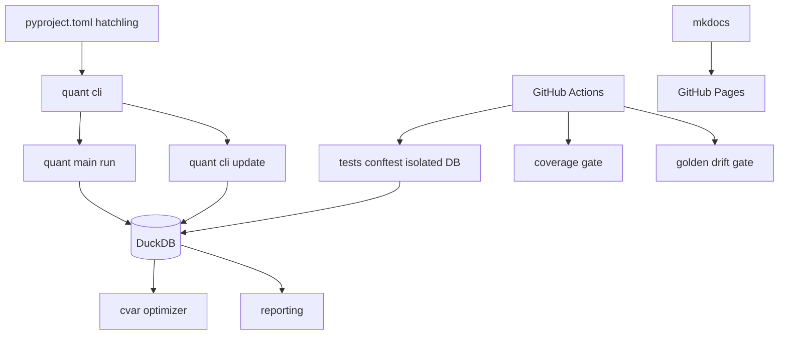

# Quant-AI v10.4.2 - Professional Transformation Plan

> **Status: COMPLETE (v10.4.2).** All six phases implemented. Full suite green
> (145 passed); coverage floor 42% (ratchet target 80%). See `CHANGELOG.md`.

Goal: lift Quant-AI from a working solo-family-office tool to a professional,
discoverable, contributor-ready package. Six phases, each independently
mergeable. Ends with documentation bump to v10.4.2.

Baseline: pyproject + README report `10.4.0`, CHANGELOG top is `10.4.1` (drift).
Target: `10.4.2`.

Design constraints (from `rules_light.txt` / `rules_heavy.txt`):
- Atomic patches only. Never rewrite a whole file.
- Pure core / imperative shell. Computation stays side-effect free.
- Verification gate: AST/lint -> typecheck -> unit sandbox. Every phase ends green.
- Parse, don't validate. Fail fast at boundaries.
- Docs update inline the moment a term crystallizes.

---

## Current State Audit

| Area | Current | Target |
|:--|:--|:--|
| Packaging | `setuptools` backend, `requirements.txt`, no deps in `pyproject` | `hatchling`, PEP 621 deps, `[dev]/[test]/[dashboard]` extras, lockfile |
| Entry points | Root wrappers `main.py`, `data_updater.py` | `quant/cli/` + `quant` console command |
| Paths | `quant/paths.py` exists, no hardcoded absolute paths (verified) | Single source of truth, enforced |
| .gitignore | Good, but `.env` file itself not ignored | Exclude `quant_cache.duckdb`, `.env`, `outputs/`, `sec_filings/` |
| Test isolation | Root `conftest.py` = sys.path only; tests hit real DB | `tests/conftest.py` ephemeral DB, auto-cleanup |
| CI | installs requirements + pytest, runs suite + golden gate | coverage gate 80%, `--strict-markers`, `pytest-xdist` |
| Golden snapshots | `tests/test_golden_snapshot.py` + `scripts/make_golden.py` | auto-regen on main, drift>0.01% fails PR, documented |
| Docs | Solid README + CONTEXT.md, version drift | Badges, Mermaid arch, API docs, CONTEXT bible |
| DX | None | pre-commit, ruff, pyright, CONTRIBUTING |
| Releases | Manual CHANGELOG | semver automation, CHANGELOG generation, optional PyPI |
| Community | None | topics, issue templates, SECURITY, CoC, launch plan |

---

## Critical Findings (adversarial review before code)

1. **conftest DB patch is a no-op as written.**
   `quant/data/database.py:6` does `DB_PATH = paths.DB_FILE` at import time.
   Monkeypatching `quant.paths.DB_FILE` afterwards does NOT change the already
   bound `database.DB_PATH`. Result: tests would read/write the production
   `quant_cache.duckdb`. Fix: patch `quant.data.database.DB_PATH` and reset the
   thread-local connection; point at `:memory:` or a tmp file.

2. **Version drift across three files.** README badge, `pyproject.toml`, and
   CHANGELOG disagree. The bump to `10.4.2` must touch all three plus badges.

3. **`requirements.txt` has non-PEP-621 reaches.** `--extra-index-url` for the
   torch CPU wheel cannot live in `[project.dependencies]`. Needs
   `[tool.uv]`/index config. `requirements.txt` is consumed by CI and README, so
   its removal is a coupled change across `ci.yml`, `README.md`, and any setup
   script.

4. **hatchling package discovery.** `quant/` is a flat package next to root
   wrappers. Wheel build must declare `packages = ["quant"]`; the root
   `main.py`/`data_updater.py` are not packaged. The `quant` console command
   must be introduced only after `quant/cli/` exists (Phase 1.2), otherwise the
   entry point dangles.

5. **Heavy CI deps.** `torch`, `transformers`, `sec-edgar-downloader` dominate
   install time. Coverage on the full suite may be slow; parallelise with
   `pytest-xdist` and consider a matrix split (fast unit vs heavy).

6. **`.venv/` and `myenv/` not in `.rooignore`.** They pollute repo-wide
   searches with thousands of false positives.

---

## Phase 2 - Testing Infrastructure & Isolation (do first)

Rationale: fix the foundation before repackaging.

- 2.1 `tests/conftest.py`: session-scoped `init_db()` fixture; patch
  `quant.data.database.DB_PATH` to an ephemeral file (or `:memory:`); reset the
  thread-local connection before/after; auto-cleanup via `tmp_path_factory`.
- 2.2 `pyproject.toml` `[tool.pytest.ini_options]`: `--strict-markers`,
  `addopts`, `testpaths = ["tests"]`.
- 2.3 `.coveragerc` + coverage gate 80% (measure first, set realistic floor).
- 2.4 `.github/workflows/ci.yml`: install via `pip install -e ".[test]"`,
  `pytest -n auto --cov`, fail on coverage regression.
- 2.5 Golden automation: `.github/workflows/golden.yml` regenerates on `main`
  push only; PR runs drift check (>0.01% fails). `tests/README.md` documents it.

## Phase 1 - Foundation & Packaging

- 1.1 `pyproject.toml`: hatchling backend, PEP 621 metadata, deps mirrored
  from `requirements.txt`, extras `[dev]`, `[test]`, `[dashboard]`. Version
  `10.4.2`.
- 1.2 `quant/cli/`: `__init__.py`, `__main__.py`, `run.py` (wraps
  `quant.main`), `update.py` (wraps `quant.data.data_updater`). Add
  `[project.scripts] quant = "quant.cli:main"`. Keep root wrappers as
  compatibility shims.
- 1.3 Lockfile: `uv lock` (or poetry). Pin exact transitive versions.
- 1.4 Paths: audit every hardcoded path; confirm all via `quant/paths.py`.
- 1.5 `.gitignore`: add `.env`, confirm `quant_cache.duckdb`, `outputs/`,
  `sec_filings/`, `__pycache__/`. Add `.venv/`/`myenv/` to `.rooignore`.
- 1.6 Update CI + README to drop `requirements.txt` (or keep as thin pointer).

## Phase 3 - Documentation & Trust Signals

- 3.1 README: restructure per spec (Highlights, Quick Start 3 commands,
  Mermaid architecture, Configuration, Testing, Contributing, Disclaimer).
  Badges only for CI/coverage/Python/License. No stargazers/forks.
- 3.2 CONTEXT.md: glossary additions, data contracts, ADR notes (Mean-CVaR vs
  Sharpe), module dependency map.
- 3.3 API docs: `mkdocs` + `mkdocs-material` + `mkdocstrings`, GitHub Pages
  deploy workflow, linked from README.

## Phase 4 - Developer Experience

- 4.1 `.pre-commit-config.yaml` (ruff, ruff-format, trailing-whitespace,
  end-of-file-fixer, check-yaml, check-added-large-files).
- 4.2 `[tool.ruff]` line-length 100, select E/F/I/N/W/UP, isort
  `known-first-party = ["quant"]`. Apply minimal safe autofix only.
- 4.3 `.vscode/settings.json` (honour ruff), pyright config, `CONTRIBUTING.md`.

## Phase 5 - Release Management

- 5.1 `bump-my-version` config + conventional-commit enforcement.
- 5.2 `git-cliff` (or release-drafter) -> CHANGELOG generation workflow.
- 5.3 Optional PyPI: `.github/workflows/publish.yml` on tag (deferred unless
  requested; name availability must be checked).

## Phase 6 - Community & Popularity

- 6.1 Repo topics, launch post draft, 2-minute demo script.
- 6.2 `.github/ISSUE_TEMPLATE/bug_report.md`, `feature_request.md`, enable
  Discussions, `FUNDING.yml`.
- 6.3 `SECURITY.md`, `CODE_OF_CONDUCT.md`.

## Documentation bump to v10.4.2 (final step)

- `pyproject.toml` version `10.4.2`.
- `CHANGELOG.md` `[10.4.2]` entry (Added/Changed/Fixed).
- `README.md` version badge + any changed commands.
- `CONTEXT.md` any new terms.
- This plan file marked complete.

---

## Target Architecture

## Execution Order

1. Phase 2 - test isolation + CI hardening (fixes the foundation).
2. Phase 1 - packaging + structure.
3. Phase 3 - docs + trust signals.
4. Phase 4 - DX.
5. Phase 5 - releases.
6. Phase 6 - community.
7. Documentation bump to v10.4.2.

## Acceptance Criteria

- [ ] `pytest` runs against an ephemeral DB; production `quant_cache.duckdb` untouched.
- [ ] `pip install -e ".[test]"` works; no `requirements.txt` dependency in CI.
- [ ] `quant` CLI command runs the pipeline.
- [ ] Coverage gate enforced at >= 80%.
- [ ] Golden drift > 0.01% fails PR; regen only on `main`.
- [ ] README one-screen pitch + Mermaid diagram + verified badges only.
- [ ] pre-commit + ruff + pyright green.
- [ ] CHANGELOG/README/pyproject all report `10.4.2`.
