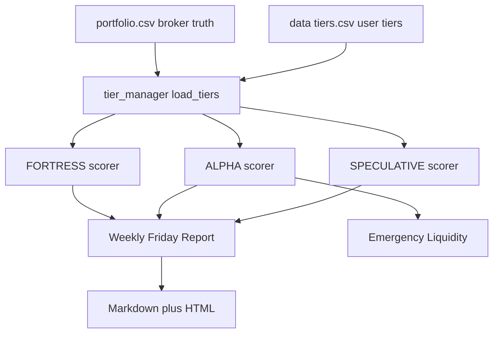
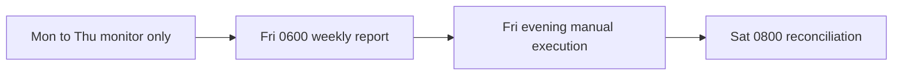

# v10.6.2 — Three-Tier Architecture Refactor Plan

Status: proposed. Target version: **10.6.2**. Base: 10.6.1 (HEAD).
Doctrine P1-P14, F1, D1 remain binding. No emoji, no decorative separators,
every number carries a source. Manual execution only (no Trade Republic API).

## Rulings recorded

- **R-TIER-1 (tier model).** Replace the legacy 4-tier system
  (CORE / SATELLITE / ACTIVE / SECTOR) with the 3-tier system
  (FORTRESS / ALPHA / SPECULATIVE). Tier assignments live in a new
  user-editable [`data/tiers.csv`](data/tiers.csv) (`symbol,tier,last_updated,notes`).
  [`data/portfolio.csv`](data/portfolio.csv) stays broker-synced and untouched.
  Legacy mapping: CORE -> FORTRESS; SATELLITE / ACTIVE / SECTOR -> ALPHA.
  Default for an unlisted symbol: ALPHA.
- **R-PDF-1 (report export).** The Weekly Friday Report ships as Markdown plus a
  self-contained HTML file with print CSS. The user prints to PDF from the
  browser. No PDF library is added. New lightweight deps: `markdown`, `jinja2`.

## Core philosophy (binding)

- **Fortress** — eternal holdings, never sold to avoid capital gains tax.
  Broad ETFs plus 3-5 core stocks via Sparplan. Quarterly review of Sparplan
  amounts only. Tactical grade and NLP sentiment are ignored.
- **Alpha** — active accumulation, the liquid reserve. Weekly rebalancing on
  Fridays. Full scoring pipeline. Sell when cash is needed.
- **Speculative** — high-risk bets, hard cap 2 percent of portfolio. Momentum
  and volume only. Stop-loss at -50 percent, take-profit at +100 percent.

## Architecture

## New and modified modules

| Module | Action | Responsibility |
|:--|:--|:--|
| [`quant/portfolio/tier_manager.py`](quant/portfolio/tier_manager.py) | new | load/save/validate tiers, get_asset_tier, migrate_legacy_portfolio, validate_tier_constraints |
| [`quant/portfolio/fortress.py`](quant/portfolio/fortress.py) | new | score_fortress_asset, quarterly Sparplan rebalance |
| [`quant/portfolio/alpha.py`](quant/portfolio/alpha.py) | new | score_alpha_asset, conviction, weekly workflow |
| [`quant/portfolio/speculative.py`](quant/portfolio/speculative.py) | new | score_speculative_asset, momentum/volume, stop-loss/take-profit |
| [`quant/portfolio/risk.py`](quant/portfolio/risk.py) | edit | calculate_liquidity_score, emergency_sell_recommendation, prioritize_sells, weekly_var_95 |
| [`quant/analytics/scoring.py`](quant/analytics/scoring.py) | edit | calculate_conviction, deflated_sharpe_ratio, tier-aware scoring |
| [`quant/portfolio/portfolio.py`](quant/portfolio/portfolio.py) | edit | merge tier info, route to tier scorers, keep backward compat |
| [`quant/reporting/weekly_report.py`](quant/reporting/weekly_report.py) | new | build_weekly_report, save_weekly_report |
| [`quant/reporting/templates/weekly_report.html`](quant/reporting/templates/weekly_report.html) | new | self-contained HTML with print CSS |
| [`quant/execution/reconciliation.py`](quant/execution/reconciliation.py) | edit | Saturday reconciliation, implementation shortfall |
| [`quant/portfolio/behavioral_guardrails.py`](quant/portfolio/behavioral_guardrails.py) | edit | max 2 Alpha trades per week |
| [`quant/reporting/actions.py`](quant/reporting/actions.py) | edit | tier-aware canonical actions |
| [`quant/ui/render.py`](quant/ui/render.py) | edit | three-tier tabs, emergency calculator, tax-loss alerts |
| [`quant/ui/copy.py`](quant/ui/copy.py) | edit | all new user-facing strings |
| [`quant/config.py`](quant/config.py) | edit | tier constants, weekly VaR, conviction, DSR, liquidity |
| [`scripts/migrate_tiers.py`](scripts/migrate_tiers.py) | new | migrate existing portfolio into 3 tiers |
| [`data/tiers.csv`](data/tiers.csv) | new | user-editable tier assignments |

## Mathematical additions

- `weekly_var_95(returns) = calculate_var_95(returns) * sqrt(5)`.
- `calculate_conviction(structural, tactical, nlp)`:
  `score = 0.3*structural + 0.4*tactical + 0.3*nlp`; HIGH > 75, MEDIUM > 60, else LOW.
- `deflated_sharpe_ratio(sharpe, num_trials, skew, kurtosis)` per Bailey and
  Lopez de Prado, with a Bonferroni multiple-comparison correction.
- `calculate_liquidity_score(symbol, price_hist)`:
  `0.4*volume_score + 0.4*spread_score - time_penalty`, clamped to 0-100.
- `prioritize_sells(holdings, amount_needed)`: liquidity high first, losers first.

## Test suite (21 tests, 7 categories)

| Category | Tests |
|:--|:--|
| 1 Look-ahead bias | bitemporal consistency, dividend leakage, split detection |
| 2 Survivorship bias | delisted assets lower CAGR, 5-year listing filter |
| 3 Mathematical soundness | deflated vs raw Sharpe, covariance stability, HMM convergence, CVaR >= VaR |
| 4 Data integrity | Yahoo drift golden snapshot, duplicate timestamps, news-source failure penalty |
| 5 Behavioral biases | overtrading penalty, recency bias, disposition effect |
| 6 Economic realism | transaction cost, liquidity constraints, Freistellungsauftrag |
| 7 System robustness | empty universe to cash, crash lockdown, API rate limit |

## Execution protocol

- One commit per step; checkpoint with hash and `git diff --stat`.
- **Update [`CHANGELOG.md`](CHANGELOG.md) after each change** (running v10.6.2 entry).
- Golden [`tests/golden/backtest_2024.json`](tests/golden/backtest_2024.json) must not move.
- Backward compatible: existing [`data/portfolio.csv`](data/portfolio.csv) keeps working;
  `quant doctor` and `quant run` keep their contracts.
- Raise the [`.coveragerc`](.coveragerc) `fail_under` ratchet toward 85 as coverage grows.

## Success criteria

1. UI clearly separates Fortress (never sell) from Alpha (sell when needed).
2. Friday reports generate automatically with no manual intervention.
3. Emergency liquidity returns a sensible sell order (liquidity first, tax-loss harvest second).
4. All 21 tests pass in CI.
5. Max 2 Alpha trades per week, cooldown enforced.
6. Tax-loss harvesting reduces capital gains tax by 15-20 percent.
